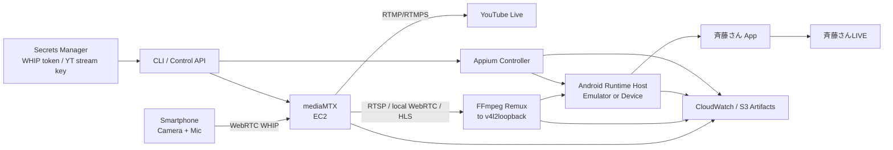
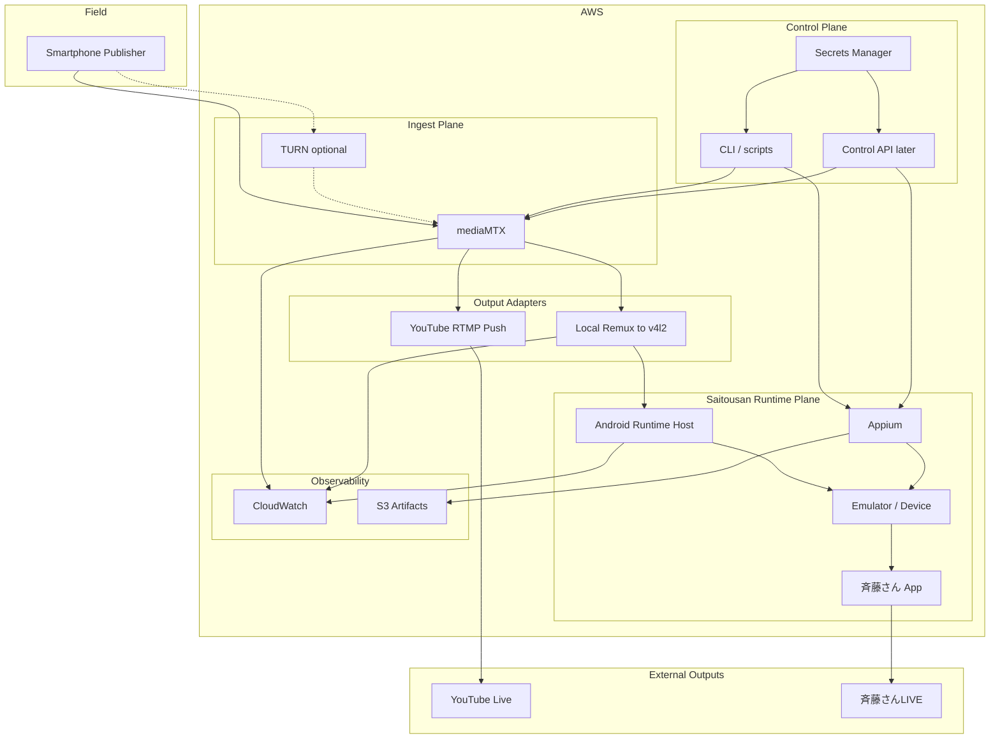

# AWS Architecture: Smartphone WebRTC → mediaMTX → YouTube / 斉藤さんLIVE

ADR-0021の構想をAWS上で実現する場合の初期アーキテクチャ案。

現行のYouTube一次配信構成（`aws-youtube-to-saitousan-live.md`）からの主な変更点:

- 一次ソースをYouTube LiveからスマホWebRTCへ移す
- EC2上のmediaMTXをingest / fan-out hubにする
- YouTubeは出力先の一つになる
- 斉藤さんLIVEは引き続きAndroid bridge経由

## System Diagram



## Component View



## Main Data Flows

| Flow | Path | Notes |
| --- | --- | --- |
| 撮影入力 | Smartphone → WebRTC WHIP → mediaMTX | 一次ソース。認証付きpathを使う |
| YouTube出力 | mediaMTX → RTMP/RTMPS → YouTube Live | stream keyはSecrets Manager想定 |
| 斉藤さん出力 | mediaMTX → local media → FFmpeg → v4l2 → Emulator → 斉藤さんApp | 公式ingestがないためbridge継続 |
| 制御 | CLI/API → mediaMTX path作成、Appium開始/停止 | UIは後回し |
| 監視 | ingest接続、YouTube push、camera preview、切断イベント | 片系障害を区別できること |

## Why mediaMTX

| Need | mediaMTXでの扱い |
| --- | --- |
| スマホからの低遅延ingest | WebRTC / WHIP publish |
| YouTube同時配信 | RTMP/RTMPS pathへpush |
| 既存Android bridge接続 | RTSPやローカルWebRTCをFFmpeg入力にできる |
| PoC規模 | 単一バイナリ + 設定ファイルで始められる |

mediaMTX以外（Nginx-RTMP、Owncast、自前SFUなど）は初期比較対象にしてもよいが、WHIP ingestとRTMP pushを一箇所で扱える点が本構成の採用理由になる。

## Suggested Phase Boundary

最初から全AWSコンポーネントを揃えない。

### Phase A
- EC2上mediaMTX
- テスト用WHIP publisher（ブラウザ可）
- ローカル再生確認

### Phase B
- YouTube RTMP push
- Secrets Managerまたは環境変数でのstream key注入
- 非公開/限定公開での視聴確認

### Phase C
- mediaMTX出力を既存v4l2/Emulator経路へ接続
- 斉藤さんフレンド限定配信
- Appium開始/停止は既存資産を再利用

### Phase D
- TURN要否の実測
- 片系障害時のfail-closed方針
- Control API / 管理UIは必要性が見えてから

## Host Placement Options

| Option | Pros | Cons | Use |
| --- | --- | --- | --- |
| mediaMTXとAndroid Runtimeを同一EC2 | 遅延が小さく、構成が単純 | 障害と負荷が同居する | Phase A〜Cの第一候補 |
| mediaMTX専用EC2 + Android別ホスト | 責務分離、スケールしやすい | ホスト間転送と運用が増える | 安定後 |
| mediaMTXのみAWS、Androidはローカル実機 | アプリ互換性を守りやすい | 遠隔運用が弱い | bridge不通時の切り分け |

## Port / Protocol Sketch

実装詳細は環境で変わるが、初期想定は次の通り。

| Direction | Protocol | Typical use |
| --- | --- | --- |
| Phone → EC2 | UDP/TCP WebRTC, WHIP over HTTPS | publish |
| EC2 → YouTube | RTMPS 443 | live ingest |
| mediaMTX → FFmpeg | RTSP localhost or WHEP | remux to v4l2 |
| Operator → EC2 | SSH / HTTPS control | start/stop, logs |

公開面に出すのはWHIP endpointと必要なICE/TURNだけに閉じ、RTSPや管理APIはプライベート側へ置く。

## Failure Modes

| Failure | Preferred behavior for PoC |
| --- | --- |
| Phone ingest切断 | 両出力を安全停止。黒画面を流し続けない |
| YouTube push失敗 | 斉藤さん側を止めるか継続するかは運用判断。ログで区別する |
| Android bridge失敗 | YouTube継続可否を明示。空の斉藤さん配信は止める |
| EC2/mediaMTXダウン | 両出力停止。単一障害点として受容し、後で分離を検討 |

## Open Architecture Questions

- WHIP publisherをブラウザPoCにするか、ネイティブアプリにするか。
- TURNを最初から入れるか、実測後に追加するか。
- YouTube向けと斉藤さん向けで別エンコードプロファイルが必要か。
- 音声をAndroid Emulatorへどう渡すか。映像bridgeとは別リスクとして残る。
- mediaMTXのpath設計を配信ジョブID単位にするか、アカウント単位の固定pathにするか。
- ADR-0018の「account単位直列化」を、ingest session単位へどう拡張するか。

## Migration Notes from Current Architecture

現行:

```text
YouTube Live → browser capture → v4l2 → Emulator → 斉藤さんLIVE
```

移行後:

```text
Smartphone → mediaMTX → YouTube Live
                     └→ v4l2 → Emulator → 斉藤さんLIVE
```

移行中はYouTube watch page経路を残し、mediaMTX経路がPhase Cまで通ってから主経路を切り替える。ADR-0019 / ADR-0020の知見はfallbackと比較基準として残す。
