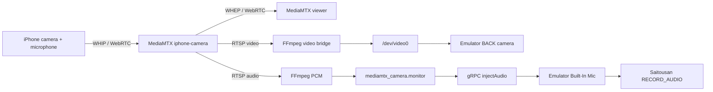

# Android Emulator音声入力切り替えRunbook

## 目的

EC2上の音声入力を、失敗しているPulseAudio direct (`-audio pa`)からgRPC `injectAudio`へ安全に切り替え、iPhone音声がAndroid guest microphoneまで届くことを段階的に検証する。

方針はADR-0021を参照する。ADR-0021は引き続き`Proposed`であり、実iPhone・10分安定性・外部確認の採用ゲート完了までは確定しない。2026-07-19に、合成入力を使ったPhase 0–4の実装・検証を開始した。

## 対象外

- 公開LIVEの開始
- 本番アカウントの利用
- 第三者映像・音声の再配信
- 斉藤さんアプリ、非公式API、通信protocolの解析
- MediaMTX viewer経路の変更
- 音声失敗時の配信中自動fallback

## Guardrails

- テストアカウントと権利処理済み素材、または合成映像・合成トーンだけを使う。
- 配信キー、Cookie、OTP、token、password、個人情報をcode、log、artifact、ADRへ保存しない。
- Emulator再起動はcamera previewとアプリ状態を切断する。LIVEが動いていないことを確認してから行う。
- フレンド限定LIVEを開始する場合も、対象、通知OFF、停止条件、実施時間を示し、人間の明示承認を得る。
- 失敗時は公開範囲を広げず、映像-onlyへ戻す。

## 目標構成



## 変更対象案

実装前にsource of truthを確定する。現在の`/home/rwatanabe/iphone-live-camera-ec2`はGit worktreeではないため、配置済みファイルを直接編集して正式実装にしない。

| Path / component | Planned change |
| --- | --- |
| `deploy/ec2/boot-emulator.sh` | `-audio pa`を`-audio none`へ変更し、loopback gRPC portを追加する |
| `deploy/ec2/android-emulator.service` | PA driver環境変数を削除し、gRPC portとstate pathを定義する |
| 新規audio orchestration script | ADB boot待機、hostmicon、MicHold、injector、recreate/latch、soft-stopを順序制御する |
| 新規`emulator-audio-inject.service` | audio orchestrationをsystemd管理し、Emulator restartへ追従する |
| `deploy/ec2/install-native.sh` | 新規script/unitをinstall・enable対象へ追加する |
| `scripts/mediamtx-to-emulator.sh` | RTSP probeをキーフレーム待ちに耐える値へ延長し、Pulse sinkへ無音keepaliveを常駐させる |
| validation script | host RMS、inject frame、guest RMS/HAL、camera非回帰を1回で判定する |

参照実装は`android-live-camera-poc`にあるが、同repositoryは未コミット差分が多い。参照ファイルだけを確認し、ユーザー差分を上書きしない。正式な配置先へ移す際は、由来と必要fileを明記する。

## Phase 0: 変更前確認

### 0.1 Gitとsource of truth

```bash
rtk git -C /home/rwatanabe/saitousan-docs status --short --branch
rtk git -C /home/rwatanabe/android-live-camera-poc status --short --branch
rtk bash -lc 'test -d /home/rwatanabe/iphone-live-camera-ec2/.git && git -C /home/rwatanabe/iphone-live-camera-ec2 status --short --branch || echo "iphone-live-camera-ec2: not a Git worktree"'
```

Gate:

- 実装を保存するGit-managed repositoryまたはworktreeが確定している。
- `android-live-camera-poc`の既存未コミット差分を移動、削除、整形しない。
- 実装repositoryが`main`なら、目的が分かる作業branchを先に作る。

### 0.2 Runtime baseline

```bash
rtk sudo systemctl --no-pager --full status mediamtx-native mediamtx-virtual-camera android-emulator
rtk adb -s emulator-5554 get-state
rtk pactl info
rtk pactl list short sinks
rtk pactl list short sources
rtk bash -lc 'tr "\0" " " </proc/$(pgrep -o qemu-system-x86)/cmdline'
rtk sudo journalctl -u android-emulator --since today --no-pager
```

Baselineへ次を記録する。

- service active state
- Emulator command line
- `Could not init pa audio driver`の有無
- current default sink/source
- guest camera device countとfacing
- MediaMTX viewerでの音声確認結果

### 0.3 実行禁止条件

次の場合は切り替えない。

- LIVEまたは配信準備中でEmulator restartが影響する。
- source of truthが未確定。
- ADB deviceが不安定、KVM/V4L2/MediaMTXが既に異常。
- test accountまたは権利処理済み素材を用意できない。
- gRPC portをloopbackに制限できない。

## Phase 1: 実装

### 1.1 Emulator起動変更

`boot-emulator.sh`の目標引数を次にする。

```text
-audio none
-allow-host-audio
-grpc 8554
-camera-back webcam0
```

`QEMU_AUDIO_DRV=pa`、`QEMU_AUDIO_IN_DRV=pa`、`QEMU_AUDIO_OUT_DRV=pa`を新構成から外す。

Gate:

- Emulator 36.6.11のgRPC listenerはwildcard bindになるため、`emulator-grpc-firewall.service`でnon-loopbackのTCP/8554を拒否し、実効的にlocal-onlyになっている。
- camera引数、AVD、KVM、GPU、port 5554の既存値を不要に変えない。

### 1.2 Audio orchestration

orchestration scriptは次を順番に実行する。

1. `mediamtx_camera.monitor`の存在と、無音でないPCM（既定`>-60 dBFS`）を待つ。
2. `adb -s emulator-5554 get-state`と`sys.boot_completed=1`を待つ。
3. `adb emu avd hostmicon`を実行する。
4. MicHold APKをinstall/updateし、`RECORD_AUDIO` permissionを付与する。
5. MicHoldを起動し、`OPEN src=` logを確認する。
6. gRPC injectorを開始する。無音PCMを先に投入しない。
7. ready state fileとframe増加を確認する。
8. MicHoldへ`RECREATE_MIC`を送り、`dBFS > -60`を待つ。
9. handoff直前に`STOP_MIC`でsoft-stopする。

MediaMTX source切断時のPulseAudio sink input消失で、EC2のPulseAudioが`memblock_replace_import()` assertionによりABRTする事象を確認した。`mediamtx-to-emulator.sh`は常時無音のPulse sink inputを1本維持し、RTSP音声の切断・再接続でmonitor自体を破棄しない。

禁止事項:

- guest mic open前にinjectorを開始しない。
- latch前にMicHoldをforce-stopしない。
- readiness timeoutを無制限retryにしない。
- injector失敗時にEmulatorを無限再起動しない。

### 1.3 systemd unit

新規unitの最低条件:

- `After=android-emulator.service mediamtx-virtual-camera.service`
- Emulator停止・再起動時にinjectorも停止する関係を持つ。
- `User=rwatanabe`相当の非root userで動く。
- `PULSE_SERVER`、source、gRPC target、state directoryを明示する。
- `Restart=on-failure`と有限のretry間隔を使う。
- stop時はinjector、MicHold、子FFmpegを順序立てて終了する。

## Phase 2: 静的検証

deploy前に行う。

```bash
rtk bash -n deploy/ec2/boot-emulator.sh
rtk bash -n scripts/emulator-audio-orchestrator.sh
rtk node --check scripts/emulator-grpc-audio-inject.mjs
rtk sudo systemd-analyze verify deploy/ec2/android-emulator.service deploy/ec2/emulator-audio-inject.service
rtk git diff --check
```

Gate:

- syntax、unit verify、diff checkがすべてPASS。
- unrelated diffがない。
- audio source名、sample rate、channel数がunitとscriptで一致する。

## Phase 3: deploy

このphaseはEmulatorを再起動する。LIVEが動いていないことを再確認する。

1. 現行unitと実行commandをartifactへ保存する。
2. 新規scriptとunitをinstallする。
3. `systemctl daemon-reload`を行う。
4. `android-emulator.service`を再起動する。
5. `android-emulator.service`のWanted sidecarとして`emulator-audio-inject.service`を起動する。
6. boot完了後、音声sourceが無ければ`waiting_for_audio`で待機することを確認する。
7. service status、journal、listenerを確認する。

確認例:

```bash
rtk sudo systemctl --no-pager --full status android-emulator emulator-audio-inject mediamtx-virtual-camera
rtk adb -s emulator-5554 shell getprop sys.boot_completed
rtk ss -ltnp
rtk sudo journalctl -u android-emulator -u emulator-audio-inject --since "10 minutes ago" --no-pager
```

即時rollback条件:

- Emulatorがbootしない、core dumpする。
- gRPCのnon-loopback TCP/8554がfirewallで拒否されていない。
- guest camera deviceが0件またはBACKでなくなる。
- `/dev/video0` readbackが黒または取得不能になる。
- injectorがguest mic open前に開始される。

## Phase 4: 合成音声smoke test

外部配信なしで実施する。

1. 合成video + 1 kHz toneを`iphone-camera`へpublishする。
2. MediaMTX RTSPにvideo/audio trackがあることを確認する。
3. Pulse monitor RMSを測る。
4. injector stateのframeとPCM RMSを2点で比較する。
5. MicHoldまたはguest HALの非無音を確認する。
6. V4L2 readbackとguest camera deviceを再確認する。

合格基準:

| Checkpoint | Pass |
| --- | --- |
| MediaMTX | video + audio trackあり |
| Pulse | RMS `> -50 dBFS` |
| Injector | frame増加、PCM RMS `> -50 dBFS` |
| Guest MicHold | RMS `> -60 dBFS` |
| Guest HAL | `> -40 dB`または同等の非無音証跡 |
| Camera | device 1件以上、Facing Back、readback非黒 |
| Crash | SIGSEGV、core dump、FATALなし |

失敗時は`PRE_EMULATOR`または`POST_EMULATOR`へ分類する。

- `PRE_EMULATOR`: Pulseまたはinject直前PCMが無音・停止。
- `POST_EMULATOR`: host/injectは正常だがguest micが無音。

## Phase 5: 10分安定性

合成音声・映像を10分連続投入する。

確認項目:

- injector frameが連続増加する。
- guest RMSが無音へ張り付かない。
- MediaMTX source reconnect後に復旧できる。
- Emulator、audio injector、camera bridgeにrestart loopがない。
- camera映像が黒化・停止しない。
- memory、CPU、log量が異常増加しない。
- RTSP source切断時もPulseAudioがABRTせず、`mediamtx_camera` sinkとmonitorが維持される。

一度でもEmulator crash、guest無音固定、camera消失が起きた場合は実iPhoneへ進まない。

## Phase 6: 実iPhone、外部配信なし

1. iPhoneでHTTPS senderを開く。
2. cameraとmicrophone permissionを許可する。
3. `iphone-camera`へpublishする。
4. MediaMTX viewerで映像と音声を確認する。
5. RTSP audio track、Pulse RMS、inject state、guest RMSを確認する。
6. 5分以上継続する。
7. senderを停止し、bridgeがstandbyへ戻ることを確認する。

合格条件:

- viewerとguest micの両方で同じ入力音声が確認できる。
- source切断後にservice crashや残留publisherがない。
- source再接続で再度guest micへ届く。

## Phase 7: 斉藤さん確認

まず外部配信を開始せず、テストアカウントで次を確認する。

- `RECORD_AUDIO` permissionがgranted。
- 斉藤さんがマイクをopenする。
- 必要な場合、マイクOFF→ONでAudioRecordを再作成すると非無音になる。
- camera previewへの非回帰がない。

フレンド限定LIVEの耳確認は別の承認gateとする。

実施条件:

- 公開範囲はフレンド限定。
- 通知をOFF。
- 実施時間と停止条件を事前に決める。
- 外部端末で音が聞こえた時点または失敗条件到達時に停止する。
- 結果を`research/validation-log.md`へ記録する。

## Rollback

gRPC切り替えに失敗した場合は、配信を開始せず次を行う。

1. `emulator-audio-inject.service`を停止・disableする。
2. Git-managed sourceから変更前のEmulator unitとboot scriptを再配置する。
3. `systemctl daemon-reload`を行う。
4. Emulatorとcamera bridgeを再起動する。
5. camera device、V4L2 readback、ADBを確認する。
6. 音声は「未提供」と明示し、映像-onlyの既知状態へ戻す。

`-audio pa`へ戻しても現EC2では音声は復旧しない。rollbackの目的は映像経路とEmulator操作の復旧である。

wav fallbackは自動rollbackではなく、別の検証作業として行う。

### wav fallbackへ進む条件

- gRPCが規定順序でも安定しない。
- Emulator versionを固定したままgRPC crashまたはlatch消失が再現する。
- 追加遅延約0.9秒をPoCとして許容できる。

wav評価では次を追加確認する。

- `qemu_in.wav`をEmulator cwdへ置く。
- 同一inodeへin-place書き込みする。
- truncate、`mv`差し替え、FIFOを使わない。
- `wavBytesRead > 10000`とguest非無音を合格条件にする。

## Evidence

各runはUTC timestampのdirectoryへ保存する。

最低限のartifact:

- service status / journal
- Emulator command line
- listener一覧
- MediaMTX ffprobe JSON
- Pulse RMS JSON
- injector ready/state JSON
- MicHold logcat
- guest `dumpsys media.audio_flinger`
- guest `dumpsys media.audio_policy`
- guest `dumpsys media.camera`
- V4L2 readback metrics
- 最終result JSON

保存禁止:

- sender URLのsecret query
- Cookie、token、OTP、password
- 配信キー
- 個人情報を含むscreenやlog

## 完了条件

作業を完了とする条件:

- ADR-0021の採用ゲートを満たす証跡がある。
- 実装、設定、検証結果、rollback手順が再現可能。
- camera経路に回帰がない。
- service restart後も規定手順でaudioが復旧する。
- 実iPhoneでviewerとguest micの両方を確認する。
- 外部LIVEを行った場合は、人間承認、対象、停止、結果が記録されている。
